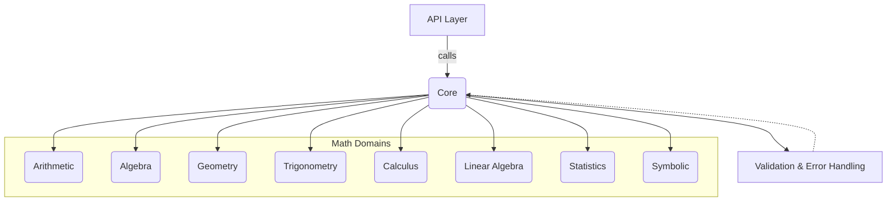

# Math Genius 🧮

A modular, extensible Python 3.12 library for foundational to advanced mathematics, designed for clean API exposure and future integration with frontend or MCP interfaces.

## 🌟 Overview

Math Genius is a comprehensive mathematical toolkit that spans from basic arithmetic to graduate-level mathematics. It's built with a modular architecture that allows for easy extension and integration into various applications.

## 🚀 Features

### 📊 Mathematical Domains
- **Arithmetic**: Basic operations (add, subtract, multiply, divide, power, modulo)
- **Algebra**: Equation solving, factoring, simplifying, expanding
- **Geometry**: Area, perimeter, volume calculations for standard shapes
- **Trigonometry**: Trigonometric functions with unit conversion
- **Calculus**: Differentiation, integration, limits, series
- **Linear Algebra**: Matrix operations, eigenvalues, linear systems
- **Statistics**: Descriptive statistics, distributions, hypothesis testing
- **Symbolic Mathematics**: Symbolic computation and expression manipulation

### 🏗️ Architecture Highlights
- **Modular Design**: Each math domain is self-contained and independently importable
- **Unified API**: Consistent interface across all mathematical functions
- **Input Validation**: Centralized validation and error handling
- **Type Safety**: Full Python 3.12 type hints support
- **Extensible**: Easy to add new mathematical domains

## 📦 Installation

```bash
pip install mathgenius
```

## 🔧 Quick Start

```python
from mathgenius.api import solve_equation, area_of_circle, differentiate

# Solve algebraic equations
result = solve_equation('x^2 - 4 = 0')
print(result)  # [2, -2]

# Calculate geometric shapes
area = area_of_circle(radius=5)
print(area)  # 78.54

# Perform calculus operations
derivative = differentiate('sin(x)', 'x')
print(derivative)  # cos(x)
```

## 📚 Module Structure

```
mathgenius/
├── core/                # Core utilities, validation, error handling
├── arithmetic/          # Basic arithmetic operations
├── algebra/             # Algebraic functions (solve, factor, simplify)
├── geometry/            # Geometric calculations
├── trigonometry/        # Trigonometric functions
├── calculus/            # Calculus operations
├── advanced/            # Advanced mathematics (linear algebra, statistics, symbolic)
├── api/                 # Unified API layer
└── validation/          # Input validation and error handling
```

## 🎯 Development Roadmap

### Phase 1: Foundation (Completed)
- ✅ Basic arithmetic and algebra tools
- ✅ Core validation and error handling
- ✅ Clean API design patterns

### Phase 2: Geometric Extensions (In Progress)
- ✅ Geometry and trigonometry tools
- ✅ Coordinate geometry functions
- ✅ Spatial problem-solving capabilities

### Phase 3: Advanced Capabilities (In Progress)
- ✅ Calculus operations
- ✅ Linear algebra functions
- ✅ Statistics and probability
- ✅ Symbolic mathematics

## 🧪 Testing

The library includes comprehensive test coverage for all mathematical operations:

```bash
pytest tests/
```

## 📖 Documentation

Detailed documentation and API reference available in the `docs/` directory:
- [Architecture Overview](docs/ARCHITECTURE.md)
- [API Reference](docs/stories/api_reference.md)
- [Usage Examples](docs/tech_docs/)

## 🤝 Contributing

We welcome contributions! Please see our development stories for current priorities:
- [Story 1: Basic Arithmetic & Algebra](docs/stories/story-1-basic-arithmetic-algebra.md)
- [Story 2: Geometry & Trigonometry](docs/stories/story-2-geometry-trigonometry.md)
- [Story 3: Advanced Mathematics](docs/stories/story-3-advanced-mathematics.md)

## 📋 Requirements

- Python 3.12+
- NumPy >= 1.24.0
- SymPy >= 1.12
- SciPy >= 1.10.0
- Matplotlib >= 3.7.0
- Pandas >= 2.0.0

## 🚀 Future Plans

- REST API exposure
- Model Context Protocol (MCP) integration
- Web interface development
- Cloud deployment options (AWS Lambda, ECS, SageMaker)

## 📄 License

This project is licensed under the MIT License - see the [LICENSE](LICENSE) file for details.

## 🏗️ Architecture

Math Genius follows a modular architecture with clear separation of concerns:



---

Built with ❤️ for the mathematics community