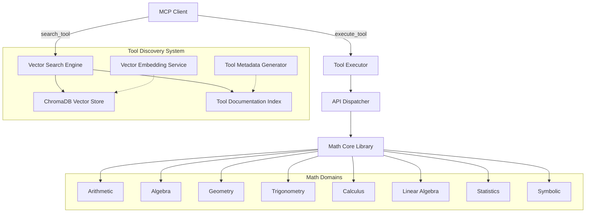
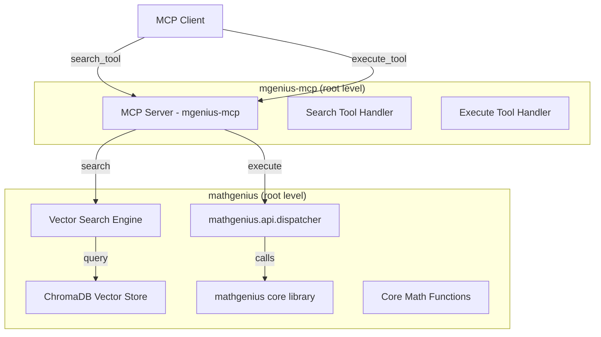

# Math Genius Backend Architecture (Python 3.12)

## 1. Overview
A modular, extensible Python 3.12 backend library for foundational to advanced mathematics, designed for clean API exposure and intelligent tool discovery through vector search capabilities.

## 1a. Architecture Diagram
Below is a conceptual component diagram showing the new search-based architecture:



---

## 2. Architectural Principles
- **Intelligent Tool Discovery:** Use vector search to find the most relevant math tools based on semantic similarity
- **Progressive Complexity:** Start simple (arithmetic/algebra), scale to advanced (calculus, stats)
- **Developer Experience:** Clean, discoverable APIs through intelligent search rather than overwhelming tool lists
- **Security & Data Integrity:** Input validation, error handling, and safe evaluation of expressions
- **Living Architecture:** Designed for easy extension and future interface layers (REST, MCP, etc)

## 3. High-Level Component Diagram

```
math_genius/
├── core/                # Core utilities, validation, error handling
├── arithmetic/          # Basic arithmetic operations
├── algebra/             # Algebraic functions (solve, factor, simplify)
├── geometry/            # Geometric calculations
├── trigonometry/        # Trigonometric functions
├── calculus/            # Calculus operations
├── linear_algebra/      # Matrix, vector, eigenvalue ops
├── statistics/          # Stats, probability, distributions
├── symbolic/            # Symbolic computation (using SymPy)
├── api/                 # Unified API layer (internal, for future REST/MCP)
├── search/              # NEW: Vector search and tool discovery
│   ├── __init__.py
│   ├── tool_indexer.py      # Tool documentation indexer
│   ├── vector_search.py     # ChromaDB-based vector search
│   ├── tool_metadata.py     # Tool metadata extraction
│   └── embeddings.py        # Text embedding generation
├── tests/               # Comprehensive test suite
└── docs/                # Usage, API reference, examples
```

## 4. Key Design Decisions

### 4.1 Original Architecture
- **Python 3.12**: Leverage latest language features, type hints, and async where needed
- **Modular Packages**: Each math domain is a self-contained module, importable independently
- **Unified API Layer**: All functions exposed via a single, consistent API (e.g., `math_genius.api`)
- **Input Validation**: Centralized in `core/validation.py` for all modules
- **Error Handling**: Custom exceptions in `core/errors.py`
- **Extensibility**: New math domains can be added as new modules with minimal friction

### 4.2 New Search-Based Architecture
- **Vector Search**: ChromaDB with SQLite backend for tool discovery via semantic similarity
- **Tool Documentation**: Automated generation of searchable tool descriptions and examples
- **Smart MCP Interface**: Only 2 MCP tools (`search_tool`, `execute_tool`) instead of 100+
- **Embedding Service**: Generate semantic embeddings for tool descriptions and user queries
- **Tool Metadata System**: Rich metadata extraction from function signatures and docstrings

## 5. New MCP Interface Design

### 5.1 Simplified MCP Tools
Instead of exposing 100+ individual tools, the new architecture exposes only 2 intelligent tools:

#### `search_tool`
```python
async def search_tool(query: str, limit: int = 5) -> List[ToolSearchResult]:
    """
    Search for mathematical tools based on description using vector similarity.
    
    Args:
        query: Natural language description of what you want to do
        limit: Maximum number of tools to return (default: 5)
    
    Returns:
        List of matching tools with relevance scores
    """
```

#### `execute_tool`
```python
async def execute_tool(tool_name: str, parameters: Dict[str, Any]) -> ToolExecutionResult:
    """
    Execute a specific mathematical tool with given parameters.
    
    Args:
        tool_name: Name of the tool to execute (from search results)
        parameters: Dictionary of parameters for the tool
        
    Returns:
        Result of the mathematical computation
    """
```

### 5.2 Tool Search Results Structure
```python
@dataclass
class ToolSearchResult:
    name: str                    # Tool name for execution
    description: str             # Human-readable description
    category: str               # Math domain category
    similarity_score: float     # Relevance score (0-1)
    parameters: Dict[str, Any]  # Parameter schema
    examples: List[Dict]        # Usage examples
```

## 6. Vector Search Implementation

### 6.1 ChromaDB Integration
```python
# Tool indexing at startup
class ToolIndexer:
    def __init__(self):
        self.chroma_client = chromadb.PersistentClient(path="./tool_index")
        self.collection = self.chroma_client.get_or_create_collection("math_tools")
    
    def index_tools(self, tools: Dict[str, ToolMetadata]):
        """Index all mathematical tools with their descriptions."""
        # Generate embeddings and store in ChromaDB
        
    def search_tools(self, query: str, limit: int = 5) -> List[ToolSearchResult]:
        """Search for tools using vector similarity."""
        # Query ChromaDB and return ranked results
```

### 6.2 Tool Documentation Generation
```python
class ToolDocumentationGenerator:
    def generate_tool_docs(self, function: Callable) -> ToolDocumentation:
        """
        Automatically generate searchable documentation for a tool.
        
        Extracts:
        - Function signature and parameters
        - Docstring and descriptions
        - Usage examples
        - Mathematical domain categorization
        """
```

## 7. Implementation Phases

### Phase 1: Core Search Infrastructure
1. **Tool Metadata Extraction**: Analyze existing math functions and extract rich metadata
2. **ChromaDB Setup**: Implement vector database with SQLite backend
3. **Embedding Service**: Create text embedding generation for tool descriptions
4. **Tool Documentation**: Auto-generate comprehensive tool documentation

### Phase 2: Search Implementation
1. **Vector Indexing**: Index all 100+ math tools with embeddings at startup
2. **Search Algorithm**: Implement semantic search with ranking and filtering
3. **Search API**: Create `search_tool` function with natural language querying
4. **Results Processing**: Format and rank search results for relevance

### Phase 3: Execution Engine
1. **Tool Executor**: Implement `execute_tool` using existing dispatcher
2. **Parameter Validation**: Integrate with existing validation system
3. **Error Handling**: Extend current error handling for search and execution
4. **Performance Monitoring**: Add metrics for search and execution performance

### Phase 4: MCP Integration
1. **New MCP Server**: Replace 100+ tool exposure with 2 intelligent tools
2. **Tool Registration**: Register `search_tool` and `execute_tool` with MCP
3. **Documentation**: Update MCP client documentation for new interface
4. **Testing**: Comprehensive testing of search accuracy and execution reliability

## 8. Component Separation: MCP Integration

### 8.1 Updated MCP Component Structure
```
mgenius-mcp/
├── __init__.py
├── server.py                  # MCP server implementation
├── search_tools.py            # NEW: search_tool and execute_tool implementations
├── handlers.py                # Updated MCP request handlers
├── config.py                  # MCP configuration
├── tests/                     # MCP-specific tests
├── pyproject.toml             # MCP package config
└── README.md                  # Updated MCP setup guide
```

### 8.2 Integration Pattern


## 9. Technology Stack

### 9.1 Core Dependencies
- **ChromaDB**: Vector database for tool search with SQLite backend
- **sentence-transformers**: Generate semantic embeddings for tool descriptions
- **NumPy/SciPy**: Mathematical computations (existing)
- **SymPy**: Symbolic mathematics (existing)

### 9.2 New Dependencies
```toml
[tool.poetry.dependencies]
chromadb = "^0.4.0"           # Vector database
sentence-transformers = "^2.2.2"  # Text embeddings
sqlite3 = "*"                 # Included with Python
```

## 10. Performance Considerations

### 10.1 Search Performance
- **Startup Time**: Index all tools once at server startup (~100 tools, <5 seconds)
- **Query Time**: Vector search response time <100ms for typical queries
- **Memory Usage**: ChromaDB SQLite backend keeps memory footprint minimal
- **Scalability**: Can handle thousands of tools with sub-second search times

### 10.2 Execution Performance
- **Tool Execution**: Same performance as current implementation (no change)
- **Parameter Validation**: Existing validation system (no performance impact)
- **Result Formatting**: Minimal overhead for response formatting

## 11. Example Usage

### 11.1 Natural Language Tool Discovery
```python
# Instead of knowing exact tool names, users can search naturally
search_results = await search_tool("calculate the area of a triangle")
# Returns: [triangle_area, triangle_area_heron, polygon_area, ...]

search_results = await search_tool("solve quadratic equation")  
# Returns: [solve_quadratic, solve_equation, factor_expr, ...]

search_results = await search_tool("matrix multiplication")
# Returns: [matrix_multiply, matrix_add, vector_dot_product, ...]
```

### 11.2 Tool Execution
```python
# Execute specific tool found through search
result = await execute_tool("triangle_area", {
    "base": 10,
    "height": 5
})
# Returns: {"result": 25.0, "success": true}
```

## 12. Migration Benefits

### 12.1 User Experience
- **Simplified Discovery**: Natural language search instead of browsing 100+ tools
- **Relevant Results**: Vector search finds semantically similar tools
- **Progressive Learning**: Users discover related tools through search results
- **Reduced Cognitive Load**: Only 2 MCP tools to understand instead of 100+

### 12.2 Technical Benefits
- **Maintainability**: Easier to maintain 2 intelligent tools vs 100+ individual tools
- **Scalability**: Adding new math functions doesn't require MCP tool registration
- **Performance**: Reduced MCP protocol overhead
- **Flexibility**: Search can be enhanced with filters, categories, examples

### 12.3 Development Benefits
- **Faster Integration**: Clients only need to understand 2 MCP tools
- **Better Documentation**: Searchable, auto-generated tool documentation
- **Enhanced Debugging**: Centralized execution path for all math operations
- **Future-Proof**: Architecture supports AI-powered tool suggestions and workflows

## 13. Deployment Options (AWS)

### Option 1: AWS Lambda (Serverless) - Updated
- **Best for:** Stateless, scalable, pay-per-use math API with vector search
- **How:**
  - Package the `math_genius` library with ChromaDB as a Lambda Layer
  - Use Amazon EFS for persistent ChromaDB storage across Lambda invocations
  - Expose via AWS API Gateway (REST or HTTP API)
  - Use AWS SAM or Serverless Framework for deployment

### Option 2: AWS ECS (Fargate) - Recommended
- **Best for:** Containerized service with persistent vector search index
- **How:**
  - Build Docker image with math_genius + ChromaDB + vector index
  - Deploy to AWS ECS with Fargate (serverless containers)
  - Use EFS or EBS for persistent ChromaDB storage
  - Application Load Balancer for API exposure

### Option 3: AWS EC2 (Traditional VM)
- **Best for:** Custom environments with full control over vector search performance
- **How:**
  - Provision EC2 instance(s) with Python 3.12
  - Install ChromaDB and build vector index on local storage
  - Deploy as a service with optimal performance tuning

---

## 14. Next Steps

### Immediate (Phase 1)
1. Implement tool metadata extraction system
2. Set up ChromaDB with SQLite backend
3. Create embedding service for tool descriptions
4. Build tool documentation generator

### Short-term (Phase 2-3)
1. Implement vector search functionality
2. Create search_tool and execute_tool functions
3. Integrate with existing API dispatcher
4. Add comprehensive testing for search accuracy

### Long-term (Phase 4)
1. Replace current MCP server with intelligent 2-tool interface
2. Update client documentation and examples
3. Performance optimization and monitoring
4. Consider additional AI-powered features (tool recommendations, workflows)

---

**This architecture transforms the overwhelming 100+ tool interface into an intelligent, searchable system that provides better user experience while maintaining all existing mathematical capabilities.**
