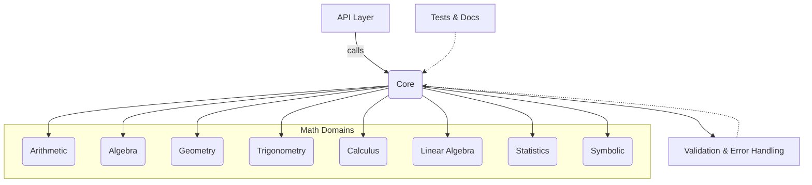
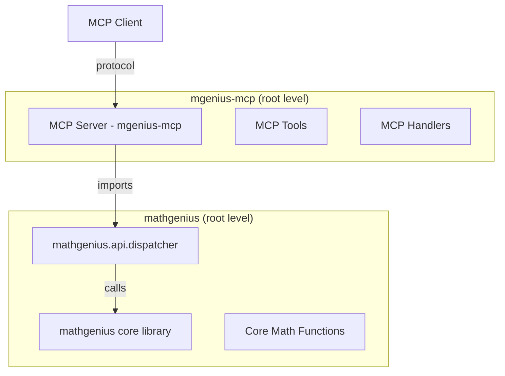
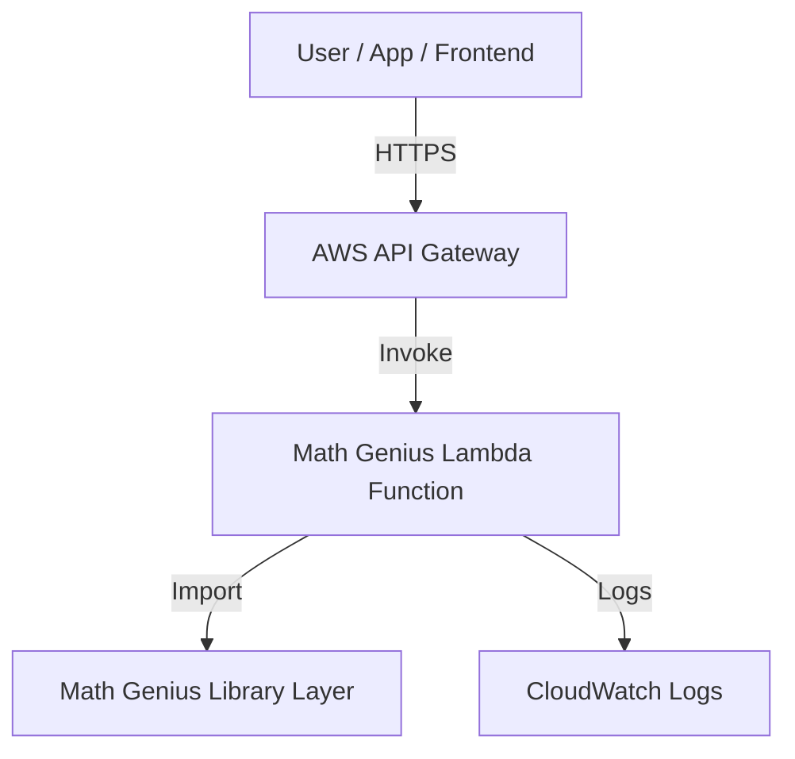

just# Math Genius Backend Architecture (Python 3.12)

## 1. Overview
A modular, extensible Python 3.12 backend library for foundational to advanced mathematics, designed for clean API exposure and future integration with frontend or MCP interfaces.

## 1a. Architecture Diagram
Below is a conceptual component diagram (text-based for markdown, can be rendered as a diagram in tools like Mermaid):



---

## 2. Architectural Principles
- **Holistic System Thinking:** All math domains are modular but unified under a single API.
- **Progressive Complexity:** Start simple (arithmetic/algebra), scale to advanced (calculus, stats).
- **Developer Experience:** Clean, discoverable APIs, strong validation, and comprehensive docs/tests.
- **Security & Data Integrity:** Input validation, error handling, and safe evaluation of expressions.
- **Living Architecture:** Designed for easy extension and future interface layers (REST, MCP, etc).

## 3. High-Level Component Diagram

```
math_genius/
├── core/                # Core utilities, validation, error handling
├── arithmetic/          # Basic arithmetic operations
├── algebra/             # Algebraic functions (solve, factor, simplify)
├── geometry/            # Geometric calculations
├── trigonometry/        # Trigonometric functions
├── calculus/            # Calculus operations
├── linear_algebra/      # Matrix, vector, eigenvalue ops
├── statistics/          # Stats, probability, distributions
├── symbolic/            # Symbolic computation (using SymPy)
├── api/                 # Unified API layer (internal, for future REST/MCP)
├── tests/               # Comprehensive test suite
└── docs/                # Usage, API reference, examples
```

## 4. Key Design Decisions
- **Python 3.12**: Leverage latest language features, type hints, and async where needed.
- **Modular Packages**: Each math domain is a self-contained module, importable independently.
- **Unified API Layer**: All functions exposed via a single, consistent API (e.g., `math_genius.api`).
- **Input Validation**: Centralized in `core/validation.py` for all modules.
- **Error Handling**: Custom exceptions in `core/errors.py`.
- **Extensibility**: New math domains can be added as new modules with minimal friction.
- **Testing**: Pytest-based, 95%+ coverage required.
- **Documentation**: Sphinx or MkDocs for API and usage docs.

## 5. Technology Boundaries
- **Backend Only**: No frontend or external API exposure yet, but API layer is ready for REST/MCP.
- **Dependencies**: Use established libraries (NumPy, SymPy, SciPy) for accuracy and performance.
- **No Database**: Stateless computation; persistence can be added later if needed.

## 6. Example API (Internal, for Future Exposure)
```python
from math_genius.api import solve_equation, area_of_circle, differentiate

result = solve_equation('x^2 - 4 = 0')
area = area_of_circle(radius=5)
deriv = differentiate('sin(x)', 'x')
```

## 7. Future-Proofing
- **API Layer**: Designed for easy wrapping as REST, gRPC, or MCP endpoints.
- **Frontend/MCP**: Conceptual model supports stateless function calls, ready for UI or protocol exposure.
- **Security**: All user input is validated and sanitized before computation.

## 8. Directory Structure (Proposed)
```
math_genius/
    core/
        __init__.py
        validation.py
        errors.py
    arithmetic/
        __init__.py
        operations.py
    algebra/
        __init__.py
        equations.py
        polynomials.py
    geometry/
        __init__.py
        shapes.py
    trigonometry/
        __init__.py
        trig_functions.py
    calculus/
        __init__.py
        differentiation.py
        integration.py
    linear_algebra/
        __init__.py
        matrices.py
        vectors.py
    statistics/
        __init__.py
        descriptive.py
        distributions.py
    symbolic/
        __init__.py
        symbolic_ops.py
    api/
        __init__.py
        dispatcher.py
    tests/
        test_arithmetic.py
        test_algebra.py
        ...
    docs/
        index.md
        api_reference.md
```

## 9. Component Separation: MCP Integration

### 9.1 Separation of Concerns Architecture
To maintain clean separation between the core mathematical library and protocol-specific interfaces, we will create two distinct components:

1. **`mathgenius`** - Core mathematical library (existing)
2. **`mgenius-mcp`** - MCP (Model Context Protocol) wrapper component

### 9.2 MCP Component Structure
```
mgenius-mcp/
├── __init__.py
├── server.py                  # MCP server implementation
├── tools.py                   # MCP tool definitions (all math tools)
├── handlers.py                # MCP request handlers
├── config.py                  # MCP configuration
├── tests/                     # MCP-specific tests
├── pyproject.toml             # MCP package config
└── README.md                  # MCP setup guide
```

### 9.3 Integration Pattern


### 9.4 Design Principles for MCP Component
- **Protocol Isolation**: MCP-specific logic contained entirely in `mgenius-mcp` at root level
- **Clean Interface**: Uses `mathgenius.api.dispatcher` as the integration point
- **Independent Deployment**: Can be deployed separately from core library
- **Version Independence**: MCP wrapper can evolve independently of core math library
- **Simple Structure**: Flat file structure for easy maintenance and deployment

### 9.5 Benefits of This Separation
1. **Maintainability**: Changes to MCP protocol don't affect core math library
2. **Reusability**: Core library can be used by other interfaces (REST, GraphQL, etc.)
3. **Testing**: Each component can be tested independently
4. **Deployment**: Components can be deployed to different environments
5. **Team Structure**: Different teams can work on each component

## 10. Next Steps
- Scaffold the directory and module structure
- Implement core arithmetic/algebra modules
- Set up testing and documentation frameworks
- Create mgenius-mcp module at root level alongside mathgenius
- Implement MCP server and tool definitions

---

## 11. Deployment Options (AWS)

### Option 1: AWS Lambda (Serverless)
- **Best for:** Stateless, scalable, pay-per-use math API
- **How:**
  - Package the `math_genius` library as a Lambda Layer
  - Expose via AWS API Gateway (REST or HTTP API)
  - Use AWS SAM or Serverless Framework for deployment
  - Store logs in CloudWatch

### Option 2: AWS ECS (Fargate)
- **Best for:** Containerized, always-on service, higher performance
- **How:**
  - Build a Docker image for the backend (with Gunicorn/FastAPI or Flask wrapper)
  - Deploy to AWS ECS with Fargate (serverless containers)
  - Use Application Load Balancer for API exposure
  - Auto-scale based on demand

### Option 3: AWS EC2 (Traditional VM)
- **Best for:** Custom environments, legacy integration, or heavy compute
- **How:**
  - Provision EC2 instance(s) with Python 3.12
  - Deploy the library and run as a service (e.g., with uWSGI/Gunicorn)
  - Use NGINX as a reverse proxy if needed

### Option 4: AWS SageMaker (for Advanced Math/ML)
- **Best for:** Advanced, ML-driven math or symbolic computation
- **How:**
  - Package advanced modules as SageMaker endpoints
  - Integrate with SageMaker for scalable, managed compute

---

## 11. Deployment Diagram (Example: Lambda + API Gateway)



---

---
**This architecture is designed for robust, extensible, and maintainable growth, with clear boundaries and future interface readiness.**
