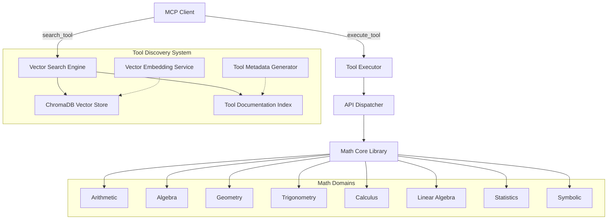

# 1a. Architecture Diagram
Below is a conceptual component diagram showing the new search-based architecture:

```mermaid
graph TD
    A[MCP Client] -->|search_tool| B[Vector Search Engine]
    A -->|execute_tool| C[Tool Executor]
    
    B --> D[ChromaDB Vector Store]
    B --> E[Tool Documentation Index]
    C --> F[API Dispatcher]
    
    F --> G[Math Core Library]
    
    subgraph "Tool Discovery System"
        B
        D
        E
        H[Tool Metadata Generator]
        I[Vector Embedding Service]
    end
    
    subgraph "Math Domains"
        J[Arithmetic]
        K[Algebra] 
        L[Geometry]
        M[Trigonometry]
        N[Calculus]
        O[Linear Algebra]
        P[Statistics]
        Q[Symbolic]
    end
    
    G --> J
    G --> K
    G --> L
    G --> M
    G --> N
    G --> O
    G --> P
    G --> Q
    
    H -.-> E
    I -.-> D
```

---
