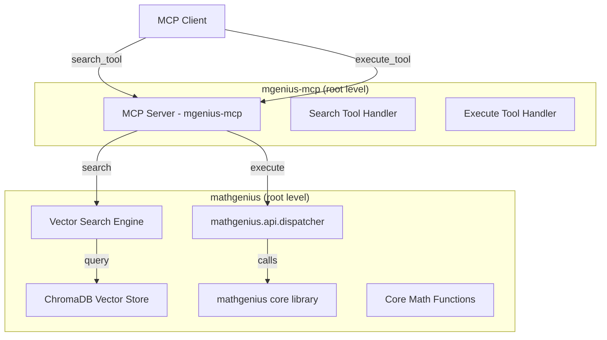

# 8. Component Separation: MCP Integration

## 8.1 Updated MCP Component Structure
```
mgenius-mcp/
├── __init__.py
├── server.py                  # MCP server implementation
├── search_tools.py            # NEW: search_tool and execute_tool implementations
├── handlers.py                # Updated MCP request handlers
├── config.py                  # MCP configuration
├── tests/                     # MCP-specific tests
├── pyproject.toml             # MCP package config
└── README.md                  # Updated MCP setup guide
```

## 8.2 Integration Pattern

